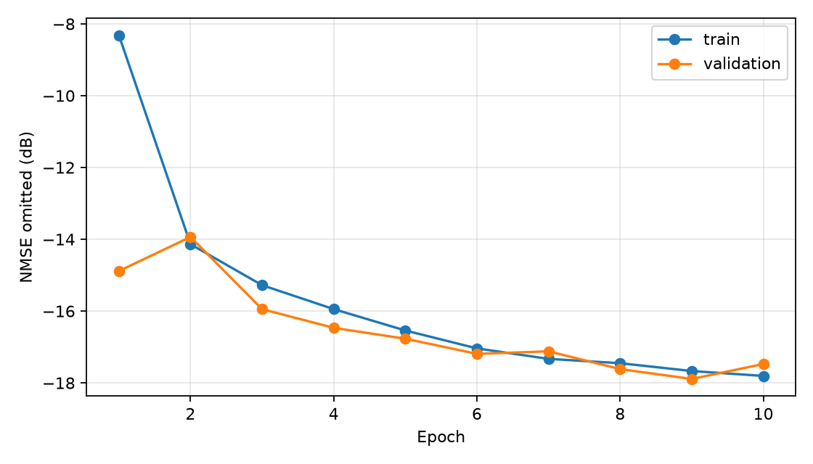
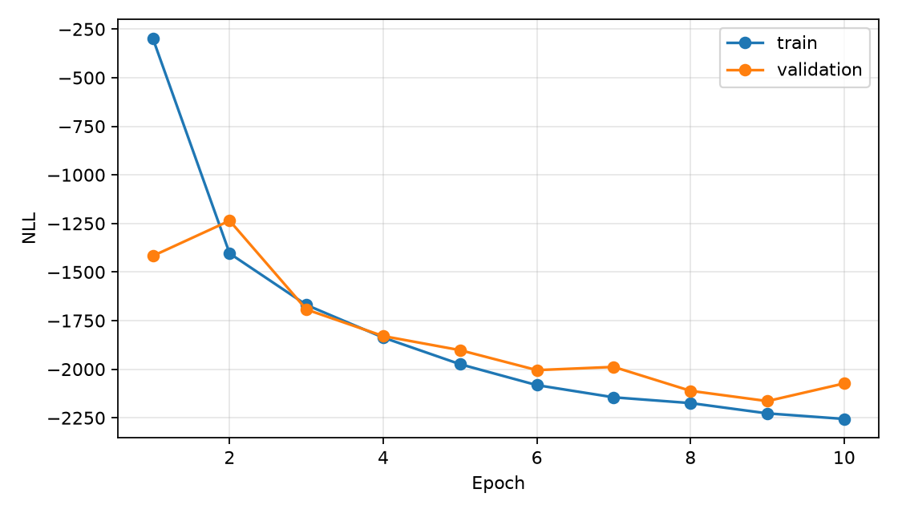
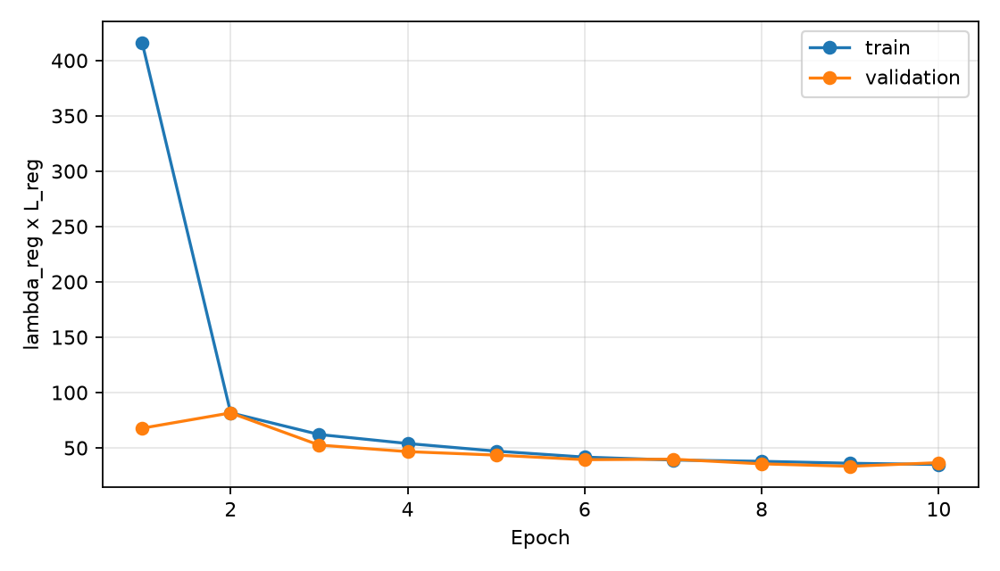
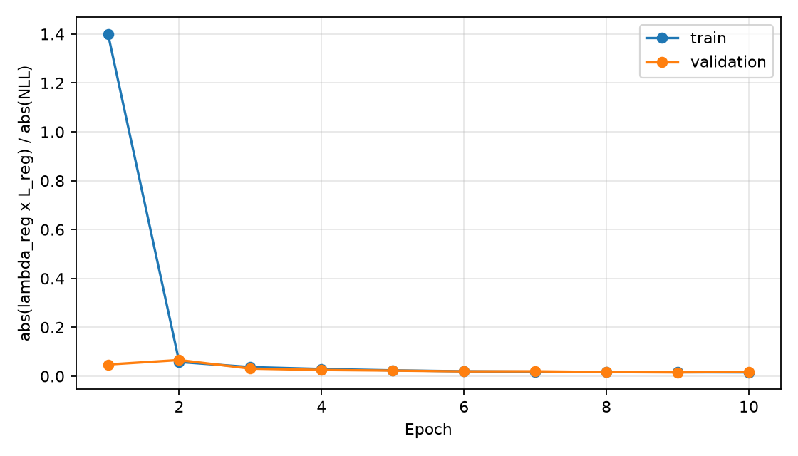
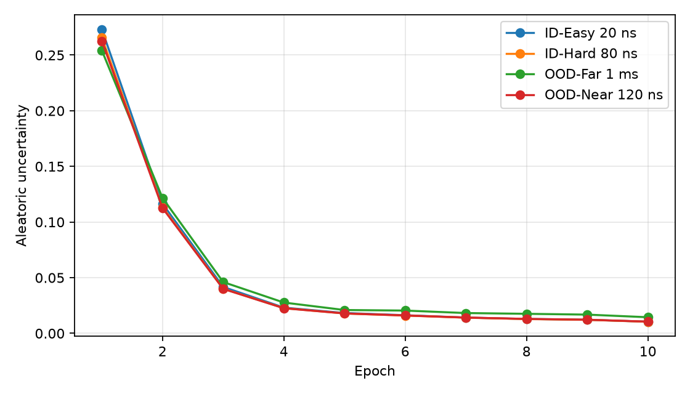
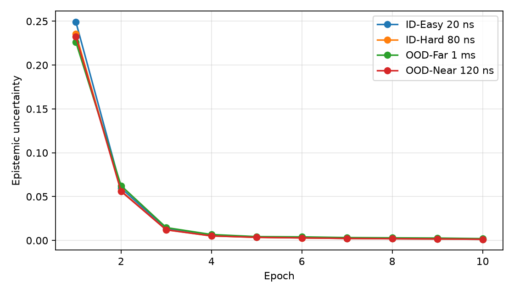
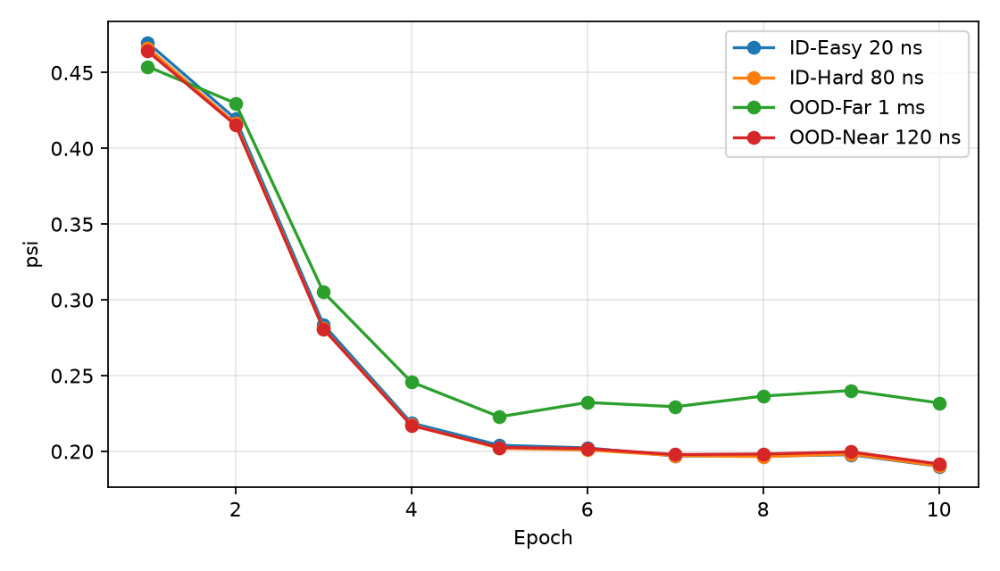
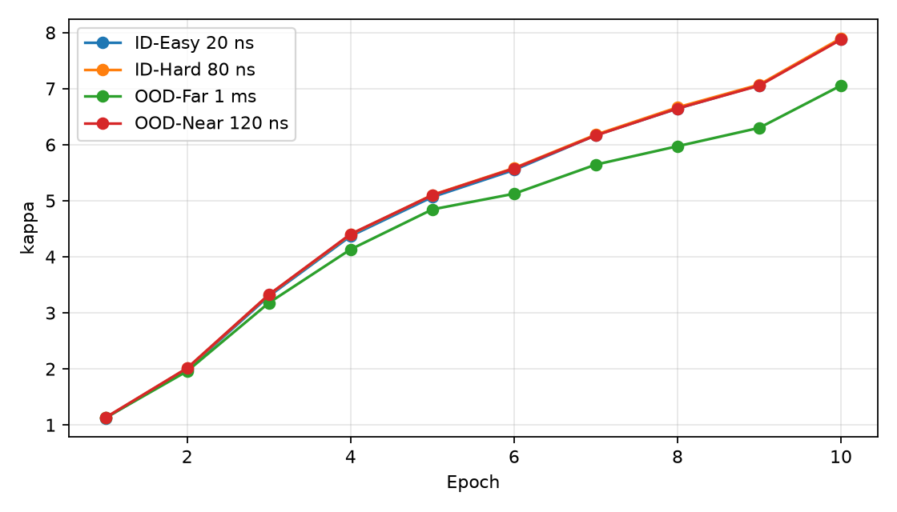
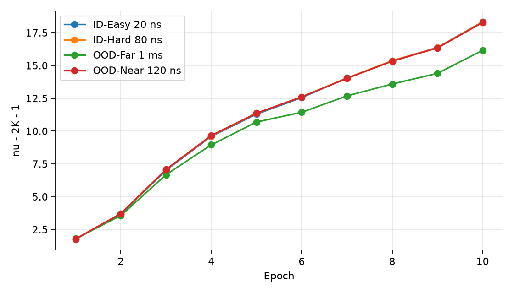

# CURRENT VALID BASELINE 그림 보고서

## 문서 목적

이 문서는 현재 유효한 UACP 기준 학습 결과의 그림을 한곳에 모아, 각 그림의 목적과
결과를 함께 확인하기 위한 자료다. 모든 그림은 기존 checkpoint의 학습 기록 또는
고정된 평가 결과에서 생성되었으며, 이 문서를 만들기 위해 재학습하지 않았다.

기준 checkpoint:

`runs/current_valid_baseline/condition_c_5k_10ep_lambda1e3_corrected/checkpoint_with_provenance.pt`

핵심 설정은 5,000개 학습 sample, 10 epoch, batch size 8, Adam, learning rate
`1e-4`, `lambda_reg=1e-3`, 15 dB reported-CFR AWGN, `Ng=16`이다. 15 dB noise
적용 위치와 TDL-A 설정은 논문에 세부 구현이 공개되지 않은 현재 구현 가정이다.

## 그림 생성 위치

학습과 평가를 실행하는 파일은 `scripts/train_current_valid_baseline.py`다. 이 파일은
각 epoch에서 `train_one_epoch()`, `evaluate()`, `diagnose_regime()`를 호출한 뒤,
`scripts/baseline_reproduction.py`의 `write_epoch_curve_pngs()`로 아래 그림을 만든다.

그림의 원자료는 다음과 같다.

- `training_curve.csv`: train/validation loss와 reconstruction 기록
- `epoch_probe_results.csv`: epoch별 20/80/120 ns/1 ms probe 기록
- `summary.csv`: 최종 probe 결과

## 1. 학습 reconstruction 확인

파일: `epoch_vs_train_validation_nmse.png`

목적: train과 validation에서 omitted-subcarrier NMSE가 epoch에 따라 개선되는지 확인한다.

결과: 학습이 진행되면서 reconstruction error가 감소한다. 따라서 Predictor가 sparse
noisy CFR과 mask를 입력으로 받아 clean full CFR을 복원하는 학습 자체는 정상적으로
진행되었다.

## 2. Student-t NLL

파일: `epoch_vs_nll.png`

목적: 모델이 예측한 Student-t 분포가 target CFR을 정리하도록 학습되는지 확인한다.

코드: `src/models/evidential.py`의 `diagonal_multivariate_student_t_nll()`.
현재 pair 하나의 차원은 `d=2K=2048`이며, 그림에는 train/validation NLL이 함께 표시된다.

## 3. Regularizer가 loss에서 차지하는 크기

파일: `epoch_vs_lambda_reg_x_l_reg.png`

목적: `lambda_reg * L_reg`가 epoch별로 실제 total loss에 얼마나 더해지는지 확인한다.

Regularizer는 prediction error가 큰데 evidence가 큰 경우를 penalize한다.
현재 식은 `||h-gamma||² * (kappa+nu)`이며, Psi는 직접 포함하지 않는다.

파일: `epoch_vs_reg_to_nll_ratio.png`

목적: 다음 비율로 regularizer의 상대적인 영향력을 확인한다.

`abs(lambda_reg * L_reg) / (abs(NLL) + eps)`

값이 크면 regularizer가 학습을 강하게 좌우할 수 있고, 작으면 NLL 중심으로 학습될
가능성이 있다. 이 그림만으로 uncertainty가 올바르게 보정되었다고 판단하지는 않는다.

## 4. Aleatoric uncertainty

파일: `epoch_vs_aleatoric.png`

목적: 20 ns, 80 ns, 120 ns, 1 ms에서 데이터 자체의 불확실성에 해당하는 Aleatoric이
어떻게 변하는지 확인한다.

현재 결과:

| Regime | 최종 Aleatoric |
| --- | ---: |
| 20 ns | 0.020904 |
| 80 ns | 0.020815 |
| 120 ns | 0.021007 |
| 1 ms | 0.028924 |

1 ms에서는 증가하지만, 80 ns가 20 ns보다 높지는 않다. 따라서 Far-OOD 반응은 있으나
ID 내부 hardness를 Aleatoric이 안정적으로 표현하지 못한다.

## 5. Epistemic uncertainty

파일: `epoch_vs_epistemic.png`

목적: training distribution에서 멀어진 입력에 대해 모델의 지식 부족을 나타내는
Epistemic이 증가하는지 확인한다.

현재 결과:

| Regime | 최종 Epistemic |
| --- | ---: |
| 20 ns | 0.002677 |
| 80 ns | 0.002642 |
| 120 ns | 0.002673 |
| 1 ms | 0.004138 |

1 ms는 ID보다 높아 Far-OOD 신호가 유지된다. 반면 120 ns는 ID와 차이가 작아
Near-OOD separation은 약하다.

## 6. Psi covariance scale

파일: `epoch_vs_psi.png`

목적: evidential head가 예측하는 covariance scale인 Psi의 regime별 변화를 확인한다.

현재 Psi는 논문의 full `2048 x 2048` covariance가 아니라 `[B,4,2048]` diagonal
approximation이다. 따라서 이 그림은 각 real/imag component의 diagonal scale 평균을
보여주며, frequency 간 correlation은 표현하지 않는다.

## 7. Kappa evidence

파일: `epoch_vs_kappa.png`

목적: 각 antenna pair에 대해 모델이 얼마나 강한 평균 evidence를 부여하는지 확인한다.

현재 `kappa`는 subcarrier별 값이 아니라 pair별 scalar이며 shape은 `[B,4,1]`이다.
Epistemic은 `Sigma_epi = Sigma_ale / kappa`로 계산되므로 kappa가 커지면 epistemic
값은 작아지는 방향으로 작동한다.

## 8. Aleatoric denominator

파일: `epoch_vs_df_cov.png`

목적: `nu - 2K - 1`이 epoch별로 어떻게 변하는지 확인한다. `K=1024`이므로
denominator는 `nu - 2049`다.

Aleatoric은 다음 식으로 계산된다.

`Sigma_ale = Psi / (nu - 2K - 1)`

따라서 Psi가 같아도 denominator가 커지면 Aleatoric은 작아질 수 있다. 이 그림은
Aleatoric 결과를 Psi만으로 해석하면 안 되는 이유를 보여준다.

## 최종 baseline 결과

| Regime | NMSE all (dB) | NMSE omitted (dB) | Aleatoric | Epistemic |
| --- | ---: | ---: | ---: | ---: |
| 20 ns | -17.6702 | -17.6709 | 0.020904 | 0.002677 |
| 80 ns | -17.2629 | -17.2605 | 0.020815 | 0.002642 |
| 120 ns | -15.2965 | -15.2930 | 0.021007 | 0.002673 |
| 1 ms | 1.3591 | 1.5622 | 0.028924 | 0.004138 |

## 요약

- reconstruction: 정상적으로 학습됨
- 20 ns -> 80 ns -> 120 ns: reconstruction 난이도 증가
- Aleatoric: 1 ms에서는 증가하지만 80 ns ID-Hard 분리는 실패
- Epistemic: 1 ms Far-OOD 신호는 확인되지만 120 ns Near-OOD 신호는 약함
- `Psi`, `kappa`, `nu-2K-1` 그림은 uncertainty가 여러 parameter의 조합으로 결정됨을 보여줌

이 baseline은 이후의 Figure 5~8 평가와 parameter-level diagnostic의 공통 기준이다.
