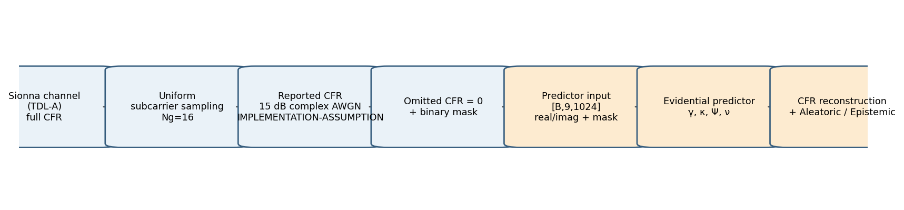
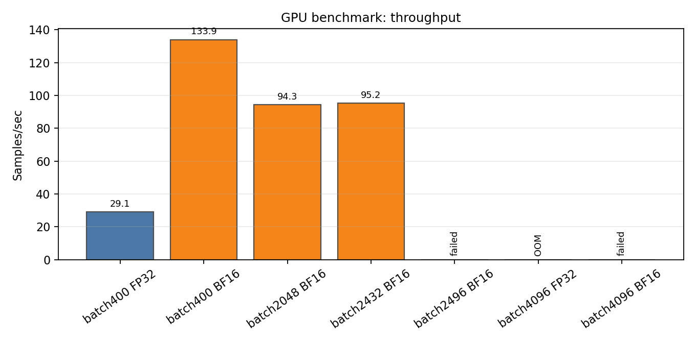
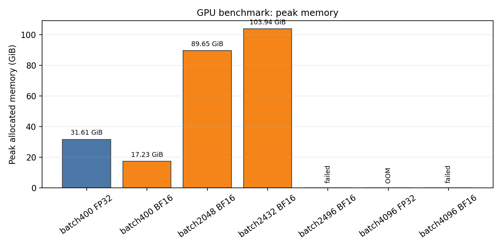
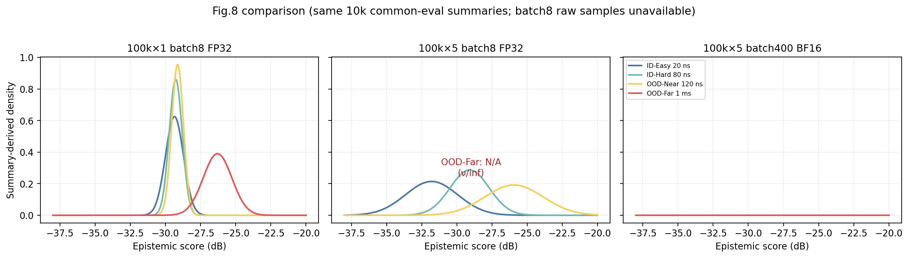
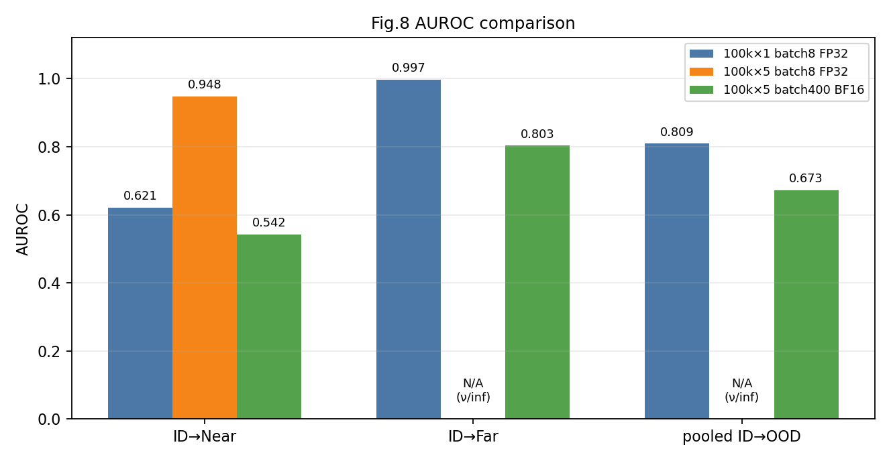
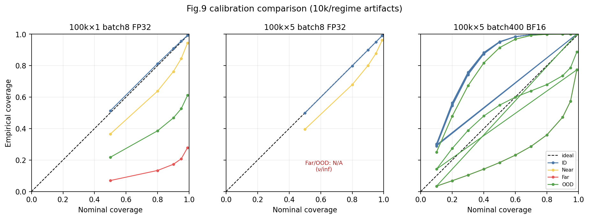
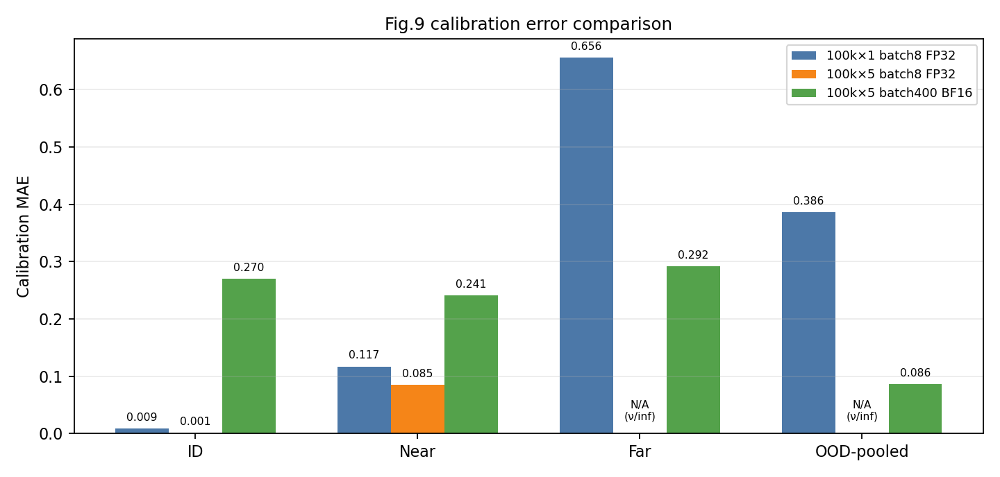

# UACP 재현 실험 보고서

**범위:** Sections 1–3 only. 기존 artifact 기반 read-only 비교 보고서  
**작성일:** 2026-09-18  
**주의:** 지정된 `/mnt/data/mobihoc26-paper289.pdf`, `/mnt/data/UACP실험.pdf`는 현재 환경에 없었습니다. repository의 `mobihoc26-paper289.pdf`, `UACP실험_250914.pdf`를 대체 참고자료로 사용했습니다.

## 1. 연구 목적 및 재현 목표

UACP는 sparse channel state information(CFR)을 입력으로 받아 full CFR을 reconstruction하고, Evidential Regression을 통해 Aleatoric uncertainty와 Epistemic uncertainty를 동시에 추정하는 구조다. Aleatoric uncertainty는 현재 channel 자체가 얼마나 reconstruction하기 어려운지를 나타내는 신호이고, Epistemic uncertainty는 predictor가 현재 channel distribution을 얼마나 낯설게 보는지를 나타내는 신호다. 이 두 신호는 feedback rate를 조절하고, OOD channel에서 추가 adaptation이 필요한지를 판단하는 데 사용될 수 있다.

본 재현의 1차 검증 기준은 세 가지다. 첫째, sparse CFR 입력으로부터의 CFR reconstruction이 정상적으로 학습되는지 확인한다. 둘째, training range 안에서 delay spread가 큰 ID-Hard 80 ns가 ID-Easy 20 ns보다 reconstruction하기 어려운지 확인한다. 셋째, training distribution 밖에서 Epistemic uncertainty가 증가해 ID와 OOD를 구분하는지 확인한다. 이후 연구 흐름에서는 calibration을 통해 uncertainty의 신뢰성을 점검하고, 최종적으로 dynamic feedback control까지 연결해야 한다. 다만 본 보고서는 Fig.11 최종 평가를 포함하지 않는다.

이 baseline은 향후 Epistemic uncertainty 기반 Full Fine-Tuning과 Partial Fine-Tuning을 비교하기 위한 출발점이다. 따라서 단일 수치의 최적화보다 reconstruction 품질, uncertainty separation, calibration, 학습 비용, numerical stability를 함께 기록하는 것이 목적이다.

## 2. 논문 기준 및 현재 재현 환경

### 2.1 원 논문의 Experimental Setup

원 논문 Section 4에 공개된 설정은 다음과 같다.

| 항목 | 논문 설정 |
|---|---|
| MIMO | 2×2 |
| Subcarriers K | 1024 |
| Carrier frequency | 3.5 GHz |
| Subcarrier spacing | 30 kHz |
| SNR | 15 dB |
| Training delay spread | Uniform [10,100] ns |
| Training samples | 100,000 |
| Batch size | 4096 |
| Epochs | 150 |
| Learning rate | 1e-4 |
| λreg | 1e-3 |

논문은 ID-easy를 20 ns, ID-hard를 80 ns로 설명하며, OOD는 training delay-spread interval을 벗어난 channel로 정의한다. 본 비교에서는 OOD-near를 120 ns, OOD-far를 1 ms로 구분했다. 이 regime 명칭과 120 ns/1 ms 세부 평가는 현재 실험 protocol의 구성으로 기록한다.

### 2.2 현재 구현 pipeline

아래 흐름은 `src/training/data.py`, `src/models/uacp_predictor.py`, `src/models/evidential.py`, `src/training/uncertainty.py`를 기준으로 정리했다. 이 그림은 문서 본문에서 설명한 뒤 배치한다.

그림 1. Sionna CFR 생성부터 mask-aware Evidential Predictor와 uncertainty 산출까지의 현재 구현 흐름.

현재 predictor 입력은 `[B, 9, 1024]`이다. 2×2 MIMO의 네 complex antenna-pair CFR을 real/imaginary 8개 channel로 펼치고, sparse CFR의 omitted 위치를 0으로 만든 뒤 binary mask 1개를 추가한다. 평가 mask는 `Ng=16`으로 uniform하게 subcarrier를 관측한다. 현재 구현의 Evidential head는 γ, κ, Ψ, ν를 만들고, Ψ는 full covariance가 아니라 diagonal approximation으로 사용된다.

### 2.3 논문과 다른 IMPLEMENTATION-ASSUMPTION

| 항목 | 논문 공개 여부 | 현재 구현 | 이유/해석 |
|---|---|---|---|
| Channel model | 정확한 Sionna TDL 설정 미공개 | Sionna TDL-A, zero mobility, normalize=false | repository의 데이터 생성 설정. `IMPLEMENTATION-ASSUMPTION` |
| SNR 적용 단계 | 15 dB는 공개되지만 noise 적용 단계는 미공개 | reported CFR에 sample-wise complex AWGN 적용, clean CFR을 target으로 유지 | 현재 observation pipeline 선택. 논문 설정이라고 단정하지 않음 |
| Covariance | full Ψ parameterization의 세부 공개 제한 | diagonal-Psi approximation, pair-scalar κ/ν | 메모리와 구현 제약을 고려한 근사 |
| Precision | 공개된 mixed-precision 조건 없음 | batch400 baseline은 BF16 AMP backbone, evidential transform/loss FP32 | GB10 throughput/memory를 위한 `IMPLEMENTATION-ASSUMPTION` |
| Mask/observation | 세부 mask 생성·noise stage 공개 제한 | uniform `Ng=16`, omitted=`1-mask`, observed 위치에만 noise | 현재 evaluator와 데이터 pipeline의 구현 선택 |

## 3. Baseline 학습 설정 비교 및 최종 선정

### 3.1 왜 Batch Size를 다시 검토했는가

논문은 batch 4096과 150 epochs를 사용하지만, 현재 NVIDIA GB10에서는 direct batch4096을 실행할 수 없었다. 기존 benchmark에서 FP32 batch4096은 106,505 MiB를 할당한 뒤 추가 3 GiB allocation에서 CUDA OOM이 발생했고, BF16 batch4096도 완료하지 못했다. 따라서 논문 수치를 그대로 실행한 관측 결과는 존재하지 않는다.

기존 batch8은 초기 재현 과정에서 GPU memory 부담을 낮추고 frequent optimizer update를 확보하기 위한 초기 reference configuration으로 사용되었다. 이는 논문 batch size가 아니라 repository의 experimental choice다. 이후 batch400은 GPU 활용률과 처리량을 높이면서도 direct batch4096보다 충분한 memory margin을 확보하는 operational configuration으로 탐색되었다. 이 이유는 repository의 benchmark와 training log에 근거하며, 역시 `IMPLEMENTATION-ASSUMPTION`이다.

두 batch를 비교할 때 batch 숫자만 비교할 수 없다. batch8은 optimizer update가 자주 발생하지만 총 step 수와 wall-clock이 커지고, batch400은 step 수를 크게 줄여 GPU throughput을 높인다. 반면 batch 크기와 mixed precision은 evidential parameter가 학습되는 경로와 uncertainty behavior에도 영향을 줄 수 있으므로, reconstruction만으로 winner를 정하지 않았다.

### 3.2 실제 Training Run 비교

세 run은 모두 100,000 unique CFR을 사용하지만 exposure와 optimizer step 수가 다르다.

| unique samples | epochs | batch | precision | total exposure | optimizer steps | actual wall-clock | samples/sec | 20 ns NMSE | 80 ns NMSE | 120 ns NMSE | 1 ms NMSE |
|---:|---:|---:|---|---:|---:|---:|---:|---:|---:|---:|---:|
| 100,000 | 1 | 8 | FP32 | 100,000 | 12,500 | 2,659.9 s (44.3 min) | 37.6 | -18.977 | -17.859 | -15.153 | 1.251 |
| 100,000 | 5 | 8 | FP32 | 500,000 | 62,500 | 44,054.9 s (12.24 h) | 11.4 | -21.802 | -19.477 | -16.468 | 1.306 |
| 100,000 | 5 | 400 | BF16 AMP + FP32 evidential | 500,000 | 1,250 | 5,579 s (93 min) | 89.6 actual / 133.9 benchmark | -17.350 | -17.094 | -15.849 | 1.416 |

그림 2와 그림 3은 이 비교에 사용한 GPU benchmark를 시각화한다.

그림 2. Batch size/precision별 실측 throughput. OOM/failed 조건은 0이 아니라 상태로 표시했다.

그림 3. Batch size/precision별 peak allocated GPU memory. 실패한 조건은 memory 수치가 아니라 OOM/failed로 표시했다.

100k×5 batch8은 reconstruction NMSE만 보면 가장 낮은 값에 도달했지만 약 12시간이 필요했고, batch400 BF16은 약 93분에 완료되었다. 따라서 batch400을 정확도 우승자로 해석할 수는 없으며, uncertainty 품질과 numerical stability를 함께 비교해야 한다.

### 3.3 GPU Benchmark와 Batch Size 효율

| 설정 | sec/step | samples/sec | GPU utilization | peak memory | 결과 |
|---|---:|---:|---:|---:|---|
| batch400 FP32 | 13.734 | 29.1 | 94.3% | 31.61 | 성공 |
| batch400 BF16 | 2.987 | 133.9 | 92.8% | 17.23 | 성공 |
| batch2048 BF16 | 21.718 | 94.3 | 92.3% | 89.65 | 성공 |
| batch2432 BF16 | 25.546 | 95.2 | 83.6% | 103.94 | 성공 |
| batch2496 BF16 | — | — | — | — | failed |
| batch4096 FP32 | — | — | — | — | OOM |
| batch4096 BF16 | — | — | — | — | failed |

batch400 BF16은 2.987 sec/step, 133.9 samples/s benchmark throughput, GPU utilization 92.8%, peak allocated 17.22 GiB였다. batch2048 BF16은 21.7183 sec/step, 약 94.3 samples/s, GPU utilization 약 92.3%, peak memory 89.65 GiB였다. 더 큰 batch가 samples/sec를 높이지 않은 것은 실제 benchmark에서 확인된 사실이며, 이 결과만으로 원인을 단정하지 않는다. 즉 현재 모델·입력·메모리 경로에서는 batch가 커질수록 반드시 효율이 증가하지 않는다.

### 3.4 논문 Scale Training이 왜 2일 이상 필요한가

논문 설정에서 `drop_last=False`라면 다음과 같다.

$$\left\lceil\frac{100000}{4096}\right\rceil=25\text{ steps/epoch}$$

$$25\times150=3750\text{ optimizer steps}$$

$$100000\times150=15,000,000\text{ sample exposure}$$

하지만 direct batch4096은 현재 GB10에서 FP32 CUDA OOM이고, BF16도 안정적으로 완료되지 않았다. 현실적인 대안으로 batch2048과 gradient accumulation 2를 가정하면, 한 epoch의 microstep은 다음과 같다.

$$\left\lceil\frac{100000}{2048}\right\rceil=49\text{ microsteps/epoch}$$

$$49\times150=7350\text{ microsteps}$$

기존 benchmark의 batch2048 BF16 평균 `21.7183 sec/microstep`을 적용하면,

$$7350\times21.7183=159,629.5\text{ sec}\approx44.3\text{ h}$$

이다. Validation, checkpoint, logging, evaluator overhead를 포함하면 약 46–50시간으로 보는 것이 타당하다. 장시간 실행 변동과 재시작 여유까지 고려하면 운영상 2–3일 규모의 실험이다. 이 계산은 OOD가 발생할 때마다 수행하는 online adaptation 시간이 아니라, 논문 규모의 initial/offline predictor training 비용이다. 또한 gradient accumulation은 effective batch4096을 구성할 수 있지만 direct batch4096과 optimizer update, noise/mask draw, gradient averaging이 완전히 같지 않으므로 `IMPLEMENTATION-ASSUMPTION`이다.

### 3.5 Fig.8 기준 Epistemic OOD 분리 성능 비교

세 baseline의 Fig.8 비교는 기존 10,000-sample/regime artifact를 우선 사용했다. batch8 두 모델은 `matched_fig8_fig9_comparison_10k_v3`, batch400 BF16은 `evaluation_streaming_v5`에서 생성되었다. score 정의는 기존 Eq.(7),(8),(12),(13) evaluator이고, batch8의 raw per-sample distribution은 보존되어 있지 않아 그림 4는 저장된 mean/std 기반 summary-derived density다. 따라서 새로운 evaluator 실행이나 재학습은 하지 않았다.

그림 4. 세 baseline의 Epistemic density 비교. 모든 panel의 축을 동일하게 맞췄으며, batch8 비교 artifact의 mean/std를 이용한 요약 분포다. 100k×5 batch8 OOD-Far는 ν/inf로 N/A 처리했다.

| baseline | ID→Near AUROC | ID→Far AUROC | pooled ID→OOD AUROC |
|---|---:|---:|---:|
| 100k×1 batch8 FP32 | 0.621 | 0.997 | 0.809 |
| 100k×5 batch8 FP32 | 0.948 | N/A (ν/inf) | N/A (ν/inf) |
| 100k×5 batch400 BF16 | 0.542 | 0.803 | 0.673 |

그림 5. Fig.8 AUROC 비교. N/A는 0이 아니라 기존 artifact의 ν/inf numerical failure를 뜻한다.

100k×1 batch8은 Near 0.621, Far 0.997, pooled 0.809로 전체적으로 안정적인 uncertainty baseline이었다. 100k×5 batch8은 Near separation이 0.948로 크게 좋아졌지만 Far 및 pooled 값은 ν/inf 때문에 유효한 비교값으로 사용할 수 없다. batch400 BF16은 모든 주요 값이 finite하고 빠르게 평가되었지만 Near 0.542, Far 0.803, pooled 0.673으로 Near-OOD separation이 약했다. 따라서 batch400을 uncertainty 성능 최고 baseline으로 해석해서는 안 된다.

### 3.6 Fig.9 Calibration 비교

Fig.9도 동일하게 기존 10k artifact를 사용했다. calibration plot은 nominal coverage와 empirical coverage를 각각 0–1로 고정하고 동일 aspect ratio로 표시했다.

그림 6. 세 baseline의 ID/Near/Far/OOD-pooled calibration curve. 대각선은 ideal coverage다.

| baseline | ID CE/MAE | Near CE/MAE | Far CE/MAE | pooled OOD CE/MAE |
|---|---:|---:|---:|---:|
| 100k×1 batch8 FP32 | 0.009 | 0.117 | 0.656 | 0.386 |
| 100k×5 batch8 FP32 | 0.001 | 0.085 | N/A (ν/inf) | N/A (ν/inf) |
| 100k×5 batch400 BF16 | 0.270 | 0.241 | 0.292 | 0.086 |

그림 7. Baseline별 calibration error 비교. N/A는 ν/inf로 계산 불가능한 값을 뜻한다.

100k×1 batch8은 ID calibration MAE 0.0086으로 안정적이지만 Near 0.1171과 Far 0.6555의 악화가 크다. 100k×5 batch8은 저장된 비교 결과에서 ID/Near/Far MAE가 낮아졌지만 Far uncertainty가 ν/inf를 포함하므로 numerical stability를 함께 해석해야 한다. batch400 BF16은 ID 0.2698, Near 0.2409, Far 0.2920, pooled OOD 0.0859로 finite했지만 ID calibration이 batch8 reference보다 크게 나쁘다. pooled OOD 하나만 낮다는 이유로 calibration이 좋다고 결론내릴 수 없으며, ID/Near/Far 분리 결과와 Fig.8 separation을 함께 봐야 한다.

### 3.7 최종 Baseline 선정

| 설정 | Training time | samples/s | memory | Reconstruction | Near OOD separation | Far OOD | Calibration | Numerical stability |
|---|---:|---:|---:|---|---:|---:|---|---|
| 100k×1 batch8 FP32 | 44.3 min | 37.6 actual | reference | 정상 | 0.621 | 0.997 | ID 0.0086 | finite |
| 100k×5 batch8 FP32 | 12.24 h | 11.4 actual | reference | 가장 낮은 NMSE | 0.948 | N/A (ν/inf) | 낮은 recorded CE, Far failure | 불안정 |
| 100k×5 batch400 BF16 | 93 min | 89.6 actual / 133.9 benchmark | 17.22 GiB | 정상 | 0.542 | 0.803 | ID 0.2698, pooled 0.0859 | finite |

본 연구에서는 논문과 가장 동일한 학습 규모를 주장하지 않는다. 현재 GB10 환경에서 training throughput, GPU utilization, memory margin, numerical stability, CFR reconstruction 및 uncertainty behavior를 종합했을 때 `100,000 samples × 5 epochs / direct batch400 / BF16 AMP backbone + FP32 evidential loss`를 가장 실용적인 operational/efficient reproduction baseline으로 선정한다. 이 선택은 Fig.8/9 성능이 가장 좋아서가 아니다. batch8×5보다 약 7배 이상 짧은 약 93분에 완료되고, GPU utilization이 높으며, memory margin이 크고, Far regime까지 finite하게 동작하기 때문이다.

동시에 한계도 명확하다. batch400 BF16은 100k×1 batch8 reference보다 Near-OOD separation과 ID calibration이 떨어진다. 따라서 이 baseline을 “가장 정확한 baseline”, “논문 재현 성공”, 또는 “논문과 동일한 설정”으로 부르지 않는다. 정확한 표현은 현재 하드웨어에서 반복 가능한 학습 비용과 reconstruction/uncertainty의 유한성까지 고려한 operational baseline이다.

**향후 추가 예정 결과.**

본 문서에는 요청 범위에 따라 Fig.11 최종 평가와 dynamic feedback control 결과를 포함하지 않았다. 이후 확정된 operational baseline에 대해 Fig.8/9 후속 검증과 Fig.11 최종 평가를 별도 절로 추가할 수 있다.

**수치 및 그림 source.**

모든 수치와 그림 source는 `report/source_data/figure_sources.json`, `report/source_data/benchmark_summary.csv`에 기록했다. 기존 checkpoint, result, CSV, log는 읽기 전용으로 사용했으며 수정·삭제·덮어쓰지 않았다.
